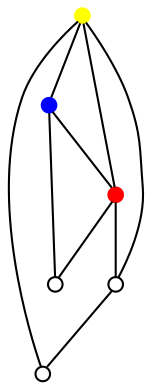

# Worlds & Systems

## Space Geography 

The enormous expanses that access to oddspace has made traversable have generated the need to map the vastness of the Five Galaxies. 
Normal space is subdivided into 10pc-sided cubes, called sub-sectors. 

Below is the conventional scale in which the Charted Space is subdivided:
- **Sub-sector**: A region of 10pc3 space in which there are several star systems.
- **Sector**: A region of 100pc3 space or 100 sub-sectors. 
- **Cluster**: Aggregation of 2 or more sectors, usually defined by political entities.
- **Quadrant**: A quarter of a galaxy, containing several territories each.

To this geography is added the topography of the Wormhole Access Network (WAN). Numerous natural and man-made wormholes are maintained to connect distant sectors and shorten travel times. Usually travel between wormholes is instantaneous and subject to a fee. A pair of wormholes is in exclusive communication, often natural wormholes are single way, while artificial wormholes are always double way, unless disabled on purpose.

## Astrography

The space is usually mapped at the local sub-sector level.  To represent a three-dimensional space, it is possible to "squash" the representation into two dimensions, representing the distances between nearest stars as edges of a graph.

